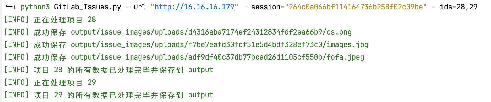
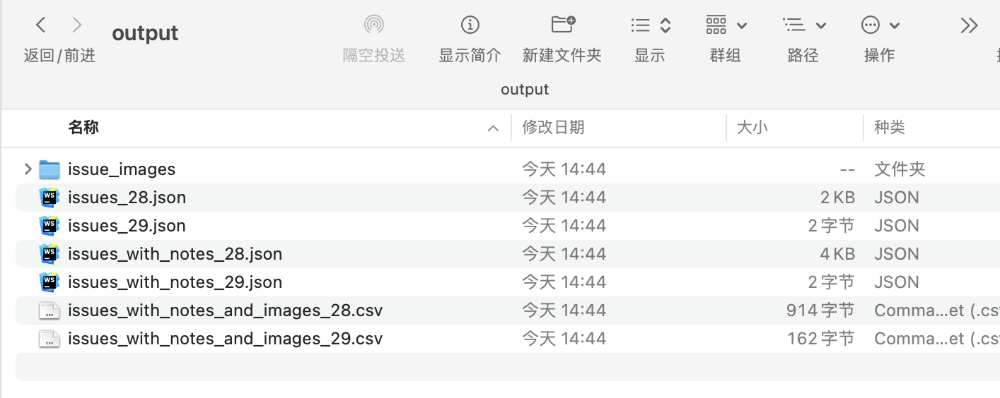

# GitLabMap
针对拿到GitLab账号权限后的GitLab项目信息获取脚本工具

GitLab_Issues.py：主要是爬取项目的issues，包括所有的notes（会同时下载notes中的附件）

即下图所示的这些内容：


基本参数：
```bash
usage: GitLab_Issues.py [-h] --url URL --session SESSION --ids IDS [-o OUTPUT]

Download GitLab issues and notes for specified projects.

optional arguments:
  -h, --help            show this help message and exit
  --url URL             GitLab base URL
  --session SESSION     GitLab session cookie
  --ids IDS             Comma-separated list of project IDs
  -o OUTPUT, --output OUTPUT
                        Output directory

```

基本使用如下：
```bash
python3 GitLab_Issues.py --url "http://192.168.16.179" --session="264c0a066bf114164736b258f02c09be" --ids=28,29,30
```

效果如下


- issue_images: 所有issues中的附件：图片、文档等
- issues_id.json: 对应项目的所有issues标题及内容
- issues_with_notes_id.json: 对应项目的所有issues标题及内容及所有回复内容
- issues_with_notes_and_images_id.csv: 将json转为表格，方便查看。